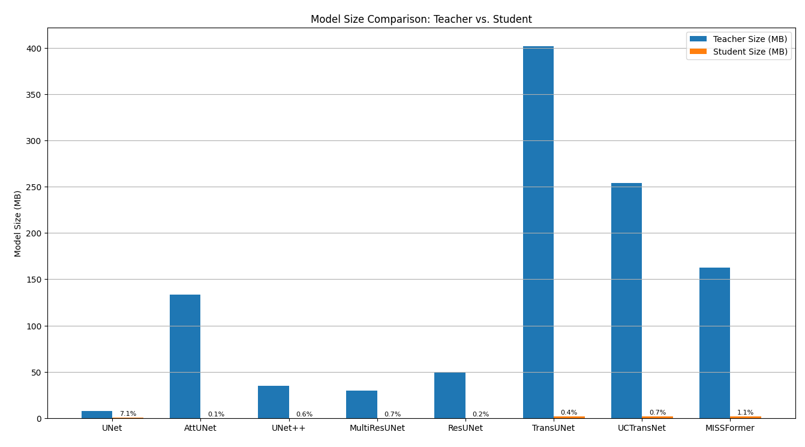
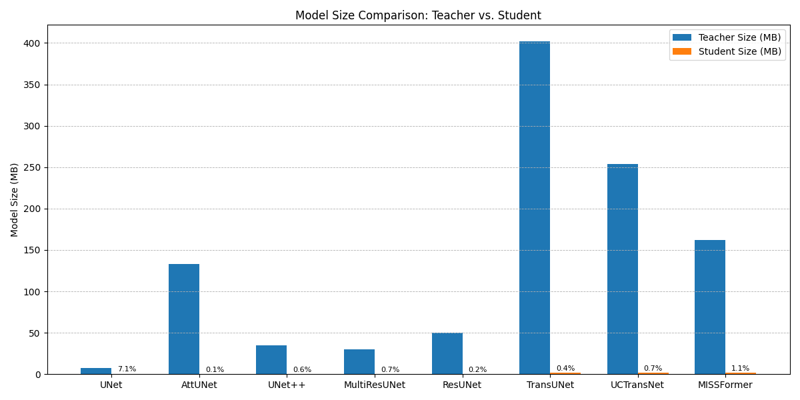

# Comparative Study on U-Net Variants Distillations​

In recent years, U-Net and its derivatives have become the cornerstone of medical image segmentation tasks, offering robust performance across various domains. However, U-Net-based architectures are known to be computationally intensive. To address this, we employ knowledge distillation to compress the model, enabling efficient deployment on resource-constrained devices. In this study, we present
a comprehensive investigation into eight U-Net-based archi-
tectures: U-Net, Attention U-Net, U-Net++, MultiResUNet,
Residual U-Net, TransUNet, UCTransNet, and MISSFormer
— applied to two widely recognized datasets: ISIC2018 and
SegPC2021.
To enhance model generalization and compress perfor-
mance into lightweight student models, we employ knowl-
edge distillation strategies, transferring knowledge from
each pretrained teacher model to its corresponding student
model. Our methodology explores both intra-architecture
comparisons (the same model across different datasets) and
inter-architecture comparisons (different models on the same
dataset).
The proposed distillation pipeline shows notable im-
provements in the segmentation accuracy and efficiency of
student models, making them more viable for clinical use
in the real world. Experimental results show that knowl-
edge distillation not only reduces model complexity, but also
maintains competitive performance, especially in low-data
or high-noise conditions. 

### Pretrained model weights from Awesome U-Net

 

Here you can download pre-trained weights for networks.

| Network            | Model Weight                                                 | Train and Test File                                          |
| ------------------ | ------------------------------------------------------------ | ------------------------------------------------------------ |
| **U-Net**          | [ISIC2018](https://mega.nz/file/pNd0xLIB#LqY-e-hdQhq6_dQZpAw_7MxKclMB5DAFMybL5w99OzM) - [SegPC2021](https://mega.nz/file/EZEjTYyT#UMsliboXuqrsobGHV_mn4jiBrOf_dMZF7hp2aY0o2hI) | [ISIC2018](https://github.com/NITR098/Awesome-U-Net/blob/main/train_and_test/isic/unet-isic.ipynb) - [SegPC2021](https://github.com/NITR098/Awesome-U-Net/blob/main/train_and_test/segpc/unet-segpc.ipynb) |
| **Att-UNet**       | [ISIC2018](https://mega.nz/file/5VsBTKgK#vNu_nvuz-9Lktw6aMOxuguQyim1sVnG4QdkGtVX3pEs) - [SegPC2021](https://mega.nz/file/gRVCXCgT#We3_nPsx_xIBXy6-bsg85rQYYzKHut17Zn5HDnh0Aqw) | [ISIC2018](https://github.com/NITR098/Awesome-U-Net/blob/main/train_and_test/isic/attunet-isic.ipynb) - [SegPC2021](https://github.com/NITR098/Awesome-U-Net/blob/main/train_and_test/segpc/attunet-segpc.ipynb) |
| **U-Net++**        | [ISIC2018](https://mega.nz/file/NcFQUY5D#1mSGOC4GGTA8arWzcM77yyH9GoApciw0mB4pFp18n0Q) - [SegPC2021](https://mega.nz/file/JFVSHLxY#EwPpPZ5N0KDaXhDXxyyuQ_HaD2iNiv5hdqplznrP8Os) | [ISIC2018](https://github.com/NITR098/Awesome-U-Net/blob/main/train_and_test/isic/unetpp-isic.ipynb) - [SegPC2021](https://github.com/NITR098/Awesome-U-Net/blob/main/train_and_test/segpc/unetpp-segpc.ipynb) |
| **MultiResUNet**   | [ISIC2018](https://mega.nz/file/tIEVAAba#t-5vLCMwlH6hzAri7DJ8ut-eT2vFN5b6qj6Vc3By6_g) - [SegPC2021](https://mega.nz/file/tUN11R5C#I_JpAT7mYDM1q40ulp8TJxnzHFR4Fh3WX_klep62ywE) | [ISIC2018](https://github.com/NITR098/Awesome-U-Net/blob/main/train_and_test/isic/multiresunet-isic.ipynb) - [SegPC2021](https://github.com/NITR098/Awesome-U-Net/blob/main/train_and_test/segpc/multiresunet-segpc.ipynb) |
| **Residual U-Net** | [ISIC2018](https://mega.nz/file/NAVHSSJa#FwcYG6bKOdpcEorN_nnjWFEx29toSspSiMzFTqIrVW4) - [SegPC2021](https://mega.nz/file/gQ91WBRB#mzIAeEUze4cAi74dMa3rqivGdYtzpKqDI16vNao7-6A) | [ISIC2018](https://github.com/NITR098/Awesome-U-Net/blob/main/train_and_test/isic/resunet-isic.ipynb) - [SegPC2021](https://github.com/NITR098/Awesome-U-Net/blob/main/train_and_test/segpc/resunet-segpc.ipynb) |
| **TransUNet**      | [ISIC2018](https://mega.nz/file/UM9jkK6B#7rFd9TiOY6pEGt-gDosFopdV78slgpHbj_wKZ4H39OM) - [SegPC2021](https://mega.nz/file/5YFBXBoZ#6S8B6MyAsSsr5cNw0-QIIIzF6CgxhEUsOl0xwAknTr8) | [ISIC2018](https://github.com/NITR098/Awesome-U-Net/blob/main/train_and_test/isic/transunet-isic.ipynb) - [SegPC2021](https://github.com/NITR098/Awesome-U-Net/blob/main/train_and_test/segpc/transunet-segpc.ipynb) |
| **UCTransNet**     | [ISIC2018](https://mega.nz/file/RMNQmKoQ#j8zGEuud33eh-tOIZa1dpkReB8DYKt1De75eeR7wLnM) - [SegPC2021](https://mega.nz/file/hYMShICa#kg5VFhE-m5X0ouE1rc_teaYSb_E15NpbBVE0P_V7WH8) | [ISIC2018](https://github.com/NITR098/Awesome-U-Net/blob/main/train_and_test/isic/uctransnet-isic.ipynb) - [SegPC2021](https://github.com/NITR098/Awesome-U-Net/blob/main/train_and_test/segpc/uctransnet-segpc.ipynb) |
| **MISSFormer**     | [ISIC2018](https://mega.nz/file/EANRiBoQ#E2LC0ZS7LU5OuEdQJ8dYGihjzqpEEotUqLEnEGZ59wU) - [SegPC2021](https://mega.nz/file/9I1CUJbZ#V6zdx8vZDyPJjHmVgoJH4D86sTuqNu6OuHeUQVB6ees) | [ISIC2018](https://github.com/NITR098/Awesome-U-Net/blob/main/train_and_test/isic/missformer-isic.ipynb) - [SegPC2021](https://github.com/NITR098/Awesome-U-Net/blob/main/train_and_test/segpc/missformer-segpc.ipynb) |

### Performance

SegPC2021 dataset 

| Model                | Accuracy  | Dice      | F1 Score  | Jaccard Index | Precision | Recall   | Specificity |
| :------------------- | --------: | --------: | --------: | ------------: | --------: | --------:| ----------: |
| Unet Teacher         | 0.987295 | 0.381007 | 0.950769 | 0.906158 | 0.967481 | 0.934625 | 0.995253 |
| Unet Student         | 0.946855 | 0.283253 | 0.771053 | 0.627410 | 0.887243 | 0.681772 | 0.986908 |
| Attunet Teacher      | 0.992199 | 0.392848 | 0.969914 | 0.941585 | 0.982193 | 0.957938 | 0.997376 |
| Attunet Student      | 0.935686 | 0.250443 | 0.698342 | 0.536501 | 0.908548 | 0.567128 | 0.991375 |
| Unet++ Teacher       | 0.991299 | 0.391629 | 0.966336 | 0.934865 | 0.981735 | 0.951413 | 0.997325 |
| Unet++ Student       | 0.936753 | 0.266133 | 0.718211 | 0.560319 | 0.864969 | 0.614030 | 0.985516 |
| MultiresUnet Teacher | 0.982802 | 0.378833 | 0.935566 | 0.878932 | 0.920454 | 0.951182 | 0.987580 |
| MultiresUnet Student | 0.905049 | 0.331823 | 0.711684 | 0.552414 | 0.591668 | 0.892780 | 0.906902 |
| ResUnet Teacher      | 0.985166 | 0.379914 | 0.942211 | 0.890736 | 0.964141 | 0.921256 | 0.994823 |
| ResUnet Student      | 0.936118 | 0.258273 | 0.707787 | 0.547733 | 0.885693 | 0.589397 | 0.988506 |
| TransUnet Teacher    | 0.976245 | 0.360031 | 0.907813 | 0.831188 | 0.925202 | 0.891065 | 0.989115 |
| TransUnet Student    | 0.963414 | 0.340373 | 0.857723 | 0.750889 | 0.876056 | 0.840142 | 0.982040 |
| UCTransNet Teacher   | 0.991686 | 0.392330 | 0.967956 | 0.937901 | 0.979593 | 0.956591 | 0.996989 |
| UCTransNet Student   | 0.964350 | 0.341848 | 0.860917 | 0.755798 | 0.882276 | 0.840568 | 0.983053 |
| MissFormer Teacher   | 0.972399 | 0.356097 | 0.893904 | 0.808162 | 0.902141 | 0.885817 | 0.985481 |
| MissFormer Student   | 0.960696 | 0.322377 | 0.840294 | 0.724576 | 0.900389 | 0.787720 | 0.986832 |

ISIC2018 dataset

| Model                | Accuracy | Dice     | F1 Score | Jaccard Index | Precision | Recall  | Specificity |
| :------------------- | -------: | -------: | -------: | ------------: | --------: | -------:| ----------: |
| Unet Teacher         | 0.940781 | 0.363407 | 0.880758 | 0.797192 | 0.866383 | 0.897067 | 0.897067 |
| Unet Student         | 0.907265 | 0.281132 | 0.787668 | 0.678718 | 0.818535 | 0.764445 | 0.764445 |
| Attunet Teacher      | 0.969936 | 0.400636 | 0.936399 | 0.883956 | 0.939933 | 0.932947 | 0.932947 |
| Attunet Student      | 0.885296 | 0.177561 | 0.687623 | 0.580620 | 0.788738 | 0.650023 | 0.650023 |
| Unet++ Teacher       | 0.968100 | 0.397767 | 0.932629 | 0.877702 | 0.935380 | 0.929929 | 0.929929 |
| Unet++ Student       | 0.885659 | 0.181108 | 0.690668 | 0.583199 | 0.788492 | 0.653117 | 0.653117 |
| MultiresUnet Teacher | 0.759706 | 0.317926 | 0.683222 | 0.540384 | 0.677889 | 0.848262 | 0.848262 |
| MultiresUnet Student | 0.603494 | 0.279942 | 0.544162 | 0.391536 | 0.604217 | 0.718724 | 0.718724 |
| ResUnet Teacher      | 0.942416 | 0.374241 | 0.884745 | 0.802947 | 0.868331 | 0.903706 | 0.903706 |
| ResUnet Student      | 0.885303 | 0.203690 | 0.708541 | 0.597996 | 0.774537 | 0.675435 | 0.675435 |
| TransUnet Teacher    | 0.964182 | 0.374213 | 0.923089 | 0.862238 | 0.933271 | 0.913582 | 0.913582 |
| TransUnet Student    | 0.916905 | 0.273946 | 0.798011 | 0.692034 | 0.860755 | 0.759299 | 0.759299 |
| UCTransNet Teacher   | 0.973047 | 0.404749 | 0.942660 | 0.894491 | 0.948842 | 0.936721 | 0.936721 |
| UCTransNet Student   | 0.903441 | 0.252269 | 0.765377 | 0.655101 | 0.821337 | 0.731208 | 0.731208 |
| MissFormer Teacher   | 0.952281 | 0.345160 | 0.895170 | 0.819156 | 0.915195 | 0.877748 | 0.877748 |
| MissFormer Student   | 0.911881 | 0.247848 | 0.768537 | 0.660412 | 0.876478 | 0.718779 | 0.718779 |

Size comparison

### Visualization

       

       

